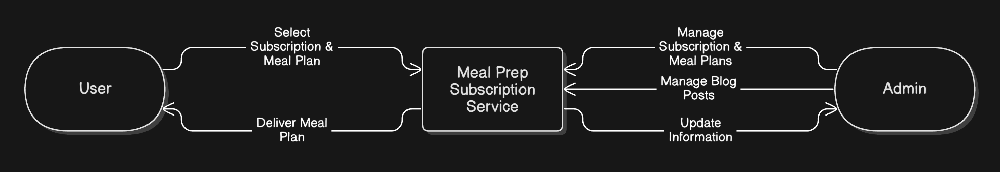
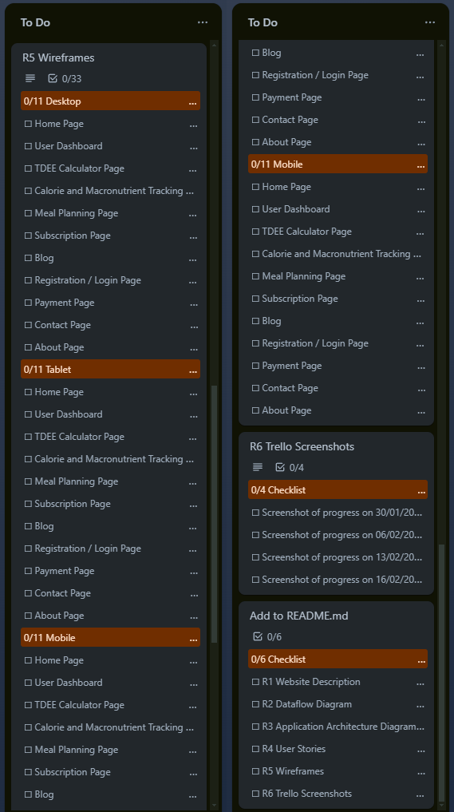

# PlateTonic T3A2-B

### Contributors

Van Nguyen - [GitHub](https://github.com/montsieur)

Veronica Chung - [GitHub](https://github.com/chung-v)

# R1 Description of your website, including purpose, functionality / features, target audience and tech stack

## Purpose

Plate Tonic is an innovative meal prep service designed to help individuals manage their weight effectively. It offers calorie and macronutrient tracking, personalised meal plans, and educational resources to support weight loss, maintenance, or muscle gain.

## Functionality / Features

### TDEE Calculator

Calculates daily calorie and macronutrient needs based on activity level and fitness goals.

### Calorie and Macronutrient Tracking

Monitors calorie and macronutrient intake to ensure users stay on track with their fitness objectives.

### Personalised Meal Plans

Allows users to input their dietary preferences and goals to receive customised meal plans.

### Subscription Models

Offers flexible weekly and monthly subscription plans for meal deliveries.

### Educational Content

Provides blogs, recipes, and tips to promote healthy eating habits.

## Target Audience

- Individuals aiming to lose weight, maintain their current weight, or gain muscle.
- Health-conscious individuals who prefer the convenience of meal prep.
- Fitness enthusiasts tracking their calorie and macronutrient intake.

## Tech Stack

### Frontend

- HTML
- CSS
- React

### Backend

- Node.js
- Express.js

### Database

- MongoDB

### Authentication

- JWT for user login and subscriptions

### Hosting

- Netlify for frontend
- Render for backend

# R2 Dataflow Diagrams

The following dataflow diagrams are structured across multiple levels to progressively illustrate greater detail about a system or process. They highlight how data moves, is processed, and is stored throughout the application.

## Legend

## Level 0 - Context Diagram

  
Click to expand - Initial Diagram

#### Updated Diagram

## Level 1 - Main Processes

### General User Dataflow Diagram

  
Click to expand - Initial Diagram

#### Updated Diagram

### Admin User Dataflow Diagram

  
Click to expand - Initial Diagram

#### Updated Diagram

## Level 2 - Sub-Processes

### User Registration and Login Dataflow Diagram

### Subscription Payment Dataflow Diagram

  
Click to expand - Initial Diagram

# R3 Application Architecture Diagram

  
Click to expand - Initial Diagram

#### Updated Diagram

## Frontend

Built with HTML, CSS, and React, the frontend creates the user interface and fetches data from the backend via API requests. It dynamically updates the UI based on user interactions and API responses. The frontend will be deployed via Netlify.

### HTML and CSS

HTML provides the structure of web pages. CSS is used for styling, layout, and responsiveness.

### React

React manages the dynamic components:

- **Registration and login**.
- **User dashboard** - Displays user data, meal plans, and subscription details.
- **TDEE calculator and calorie/macronutrient tracker** - Tracks calorie and macronutrient intake.
- **Meal plan menu** - Displays available meal plans.
- **Subscription plan menu** - Handles plan selection and management.
- **Blog posts** - Displays health and nutrition articles.

## Backend

Built using Node.js and Express.js, the backend handles business logic, data processing, authentication, and API routing. It utilises middleware for logging, error handling, and request validation, while environment variables manage configurations for scalability. The backend will be deployed via Render.

### Node.js and Express.js

Key components include:

- **Authentication service** - Manages user login and registration using JWT authentication.
- Calorie and macronutrient tracker - Monitors and stores user calorie and macronutrient intake.
- **Meal plan service** - Fetches and stores personalised meal plans based on user preferences.
- **Subscription service** - Handles user subscriptions and integrates with **Stripe** for payment processing.
- **Blog service** - Manages blog content, including creation, updates, and retrieval.

### Mongoose

Mongoose is an Object Data Modeling (ODM) library that structures and interacts with MongoDB. It queries the database to retrieve, update, and store data.

## Database

The database communicates with the backend by sending and receiving structured documents.

### MongoDB

The application uses MongoDB to store:

- **User data** - Account details, macro tracking, dietary preferences, and payment records.
- **Meal plan data** - Tailored meal plans based on user preferences and goals.
- **Subscription data** - User subscription details, including plan type and payment status.
- **Blog data** - Health and nutrition articles.

## Third Party APIs

### Stripe

Stripe is integrated as the payment gateway to handle subscriptions and payments securely.

The process involves:

1. **Frontend** - Provides a payment form where users enter card details. **Stripe.js** securely tokenises the card information and sends it to Stripe’s servers.
2. **Backend** - Communicates with Stripe’s API using a **secret key** to create a payment intent and process transactions.
3. **Webhooks** - Stripe webhooks are used to handle payment events (e.g. successful payments, subscription cancellations) and update the database accordingly.
4. **Database** - Payment status and subscription details are stored in MongoDB.

# R4 User Stories

## Persona 1 - Personal Trainer

### User Stories

"As a personal trainer, I want a meal prep service that helps me optimise my macronutrient intake, so I can improve my muscle gain and endurance."

"As someone with a busy training schedule, I want healthy meals that are quick and easy to prepare, so I can stay on top of my nutrition and fuel my workouts without sacrificing performance."

## Persona 2 - Software Engineer

### User Stories

"As a professional who works long hours, I want a meal prep service that offers healthy, ready-to-eat meals, so I can maintain a balanced diet despite my demanding schedule."

"As someone with limited nutrition knowledge, I want access to meal plans that are designed for weight management, so I can make better food choices without extensive research."

## Persona 3 - Stay At Home Mother

### User Stories

"As a health-conscious mother, I want a meal plan that supports my personal health goals, so I can maintain a balanced diet and feel energised throughout my day."

"As a mother of two, I want a meal plan that accommodates my children's dietary preferences, so I can ensure they enjoy their meals while still meeting their nutritional needs."

# R5 Wireframes for multiple standard screen sizes, created using industry standard software

For each page, we have planned and designed low to medium level fidelity using Figma. This is to show and demonstrate and draft each page's layout to understand the project's flow, structure and the usage and implementation of each component on each page. Furthermore, this will be set as the base standard to create a high fidelity wireframe in the future and improve on the user interface to ensure user experience is met to it's full potential.

Each wireframe template uses the following dimensions of approximately as base and ensures responsive design:

- **Desktop**: 1920 x 1080
- **Tablet**: 728 x 1024
- **Mobile**: 375 x 812

Each page will consist of at least:

- **Navigation Bar**: To navigate to different pages of the website such as user login page, menu, about, contact, etc.
  - In mobile view, the navigation buttons will be condensed into a hamburger style drop down menu.
- **Footer**: Will consist of different hyperlinks to different pages as above.
  - In mobile view, this will be condensed into a drop down menu.

## 1. Homepage

The home page will consist of the main information of marketing Plate Tonic as a meal prep service.

The key features will include:

- **Banners**: As images to showcase and market the brand such as brand information and testimonials.
- **Buttons**: To redirect a user to relevant page.
  - For example, clicking on "Get Started" will direct a user to the TDEE page to calculate their recommended calorie intake and macro.

### Wireframe

  
Click to expand - Home Page

### Detailed Wireframe

  
Click to expand - Home Page

/home_page.jpg>)

## 2. About Page

The purpose of the about page is to provide information about the company such as the business goal and objectives for the user to get to know more about the company.

The key features will include:

- **Images & Text**: This will consist of main marketing image and information text about Plate Tonic.

### Wireframe

  
Click to expand - About Page

### Detailed Wireframe

  
Click to expand - About Page

/about_page.jpg>)

## 3. Login Page

The login page will allow a user to use their registered information to then access the user dashboard.

The key features will include:

- **Fill Text**: This is where the user will input their email address and password.
- **Login button**: This button is to redirect the user to the user dashboard if successful.
- **Hyperlinks**: If a user has forgotten their password or has not registered an account yet, there will be a hyperlink option for the user to do what they require.

### Wireframe

  
Click to expand - Login Page

### Detailed Wireframe

  
Click to expand - Login Page

/login_page.jpg>)

## 4. Registraton Page

The registration page is accessed from the login page once the user has clicked on the hyperlink option. Here they are able to enter their details to register an account.

The key features will include:

- **Fill Text**: Allows the user to enter their email address, password, first and last name.
- **Submit button**: Will allow user to submit their details to create an account if email address is not in use.
- **Hyperlink**: If a user has an account already or notices that the email address has been used already, they can redirect themselves to the login page to attempt to log in or direct themselves to the forgot password page.

### Wireframe

  
Click to expand - Register Page

### Detailed Wireframe

  
Click to expand - Register Page

/register_page.jpg>)

## 5. User Dashboard Page

The purpose of the user dashboard is to allow the user to navigate through their account and access certain features that are available to them such as managing subscriptions, viewing their current meal plan, tracking their calories and macros or to update/view their personal details.

The key features will include:

- **Buttons**: This will allow the user to navigate between the following options such as clicking on subscription to view it in the content next to it (on the right).
- **Information Box**: A windowed area next to the button navigations will show the user relevant information to what they have clicked on
  - For example, clicking on Subscription after viewing their personal details will change the window to show the user their current subscription.

### Wireframe

  
Click to expand - User Dashboard Page

### Detailed Wireframe

  
Click to expand - User Dashboard Page

/user_dashboard_page.jpg>)

## 6. TDEE Page

The TDEE Page (Total Daily Energy Expenditure) is a page that allows the user to enter their details to calculate the recommended calorie and macro intake for their meal plans.

The key features will include:

- **Buttons**: The user will be able to click the relevant button to enter their details. Once they enter all details, they can click on the submit button to be redirected to the next page (menu page) to show their recommended calorie and macro intake and the recommended meals.
  - The information to click and enter will consist of their gender, age, current and target weight and their current activity for exercise.

### Wireframe

  
Click to expand - TDEE Page

### Detailed Wireframe

  
Click to expand - TDEE Page

/TDEE_page.jpg>)

### Wireframe

## 7. Subscription Page

The subscription page allows user's to opted in to Plate Tonic's services so they are able gain access to specific features such as choosing/ordering their meals for their meal plan.

The key features will include:

- **Buttons**: This allows users to choose from the following options that suits their needs.
  - For example, user can choose between a weekly or monthly subscription. By choosing a monthly subscription, it can be slightly cheaper allowing the user to save on expense.
- **Fill Text**: An area for the user to enter their details such as postal address.
- **Drop down Menu**: This area will allow the user to choose from the following payment methods to purchase the subscription.
- **Information box**: This will show the user the summary of their chosen options and pricing before hitting the submit button below.

### Wireframe

  
Click to expand - Subscription Page

### Detailed Wireframe

  
Click to expand - Subscription Page

/subscription_page.jpg>)

## 8. Menu Page

The menu page is for the user to see what meals are available to choose from before they subscribe to the services or to choose their meals if they are already using the service.

The key features will include:

- **Filter Menu**: User will be able to filter accordingly to filter options to their needs.
- **Calorie/Macro information**: Once a user has entered their information on the TDEE calculator, this information will show and calculate accordingly to what is recommended as reference and total of calories/macros from the meals chosen. If the user has not entered these details, there will be a hyperlink to redirect the user to calculate if they wish to do so.
- **Image Button**: A list of meals a user can view. Once they click on one of the options, it will show the user in a small window more information about that specific meal.

### Wireframe

  
Click to expand - Menu Page

### Detailed Wireframe

  
Click to expand - Menu Page

/menu_page.jpg>)

## 9. Payment Page

The payment page is the final page after submitting the details from the Subscription Page. Here the user is able to enter their payment details and finalize their purchases

The key feature will include:

- **Fill Text**: This area is for the user to enter their billing details and payment method details.
- **Button**: For user to submit and finalize their purchase.

### Wireframe

  
Click to expand - Payment Page

### Detailed Wireframe

  
Click to expand - Payment Page

/payment_page.jpg>)

## 10. Blog Page

The blog page will contain different articles that a user can view and access that shows different information. For example, an article on 'How to stay fit' is a blog post a user can view to get more information about this topic.

The key feature will include:

- **Filter Menu**: User is able to filter by the topic of what they wish to see.
- **Image Link**: User is able to access the blog post by clicking on the image and this will redirect them to the blog itself.

### Wireframe

  
Click to expand - Blog Page

### Detailed Wireframe

  
Click to expand - Blog Page

/blog_page.jpg>)

## 11. Contact Page

The contact page's purpose is to allow user to send any enquiries they have whether it is about the brand, services, etc.

The key feature will include:

- **Fill Text**: An area where the user is able to enter the details of their query.
- **Button**: After entering the details, user can click the send/submit button to send off their query.
- **Information Box**: An area providing further information for the user.
  - For example: "If you have any queries about any of our services or require assistance, feel free to submit it through our contact page. We are always happy to help you and will get back to you as soon as possible".
  - It will also contain a direct email if they wish to do so rather submitting it through the contact page.

### Wireframe

  
Click to expand - Contact Page

### Detailed Wireframe

  
Click to expand - Contact Page

/contact_page.jpg>)

# R6 Screenshots of your Trello board throughout the duration of the project

Our team used Trello to implement Agile methodology and streamline task management. Trello’s visual interface made it easy to track progress at a glance.

To organise our workflow, we structured our Trello board into four lists representing task progress:

- **To Do** - Pending tasks.
- **Doing** - Tasks in progress.
- **Review** - Completed tasks awaiting feedback.
- **Done** - Approved and finalised tasks.

We followed an iterative approach, moving tasks through these stages. Once a task reached the Review column, team members provided feedback to ensure it met project standards. After approval, the task was documented in the README file on our repository and moved to Done.

In addition to Trello, our team held weekly check-ins to review progress and discuss pain points. We also used Discord for ongoing collaboration, allowing us to discuss the project in real time. This approach helped maintain alignment and adaptability throughout the development process.

## 28 January

Cards have been created with detailed checklists for clarity. The team has established a structured check-in schedule, meeting every Thursday to review progress. A final check-in has been scheduled on the day of the deadline to ensure all tasks are completed and project objectives are met.

## 31 January

Weekly check-ins have been shifted to Fridays to better align with our personal schedules. The "Website Description" has been completed, and team members have begun working on "User Stories" and "Wireframes".

Adjustments have been made to the "Wireframes" checklist to streamline certain pages for simplicity.

### Screenshot of Progress

## 7 February

"User Stories" and "Wireframes" have been submitted for review. Work has begun on drafting the various diagram levels within the "Data Flow Diagram."

### Screenshot of Progress

## 14 February

The team has begun adding components to the README file in the repository. The "Data Flow Diagram" has been completed, while the "Wireframes" have been re-evaluated for further refinement, requiring additional adjustments to the home page and user dashboard.

Adjustments have been made to the "Application Architecture Diagram" checklist for a more detailed breakdown of the required tasks.

### Screenshot of Progress

## 16 February

All tasks have been completed, reviewed, and documented in the README file within the repository.

