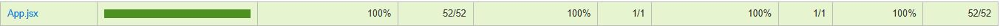
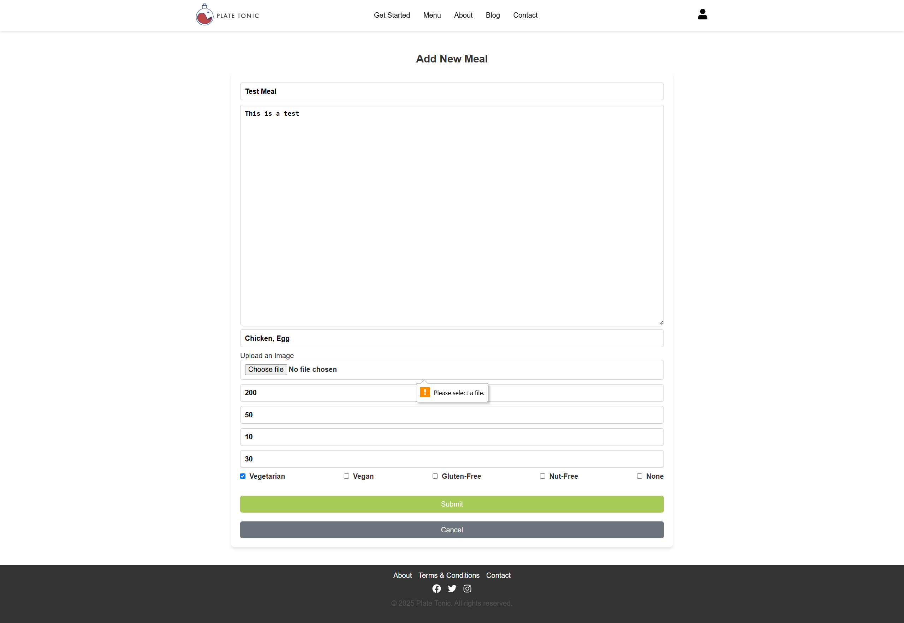
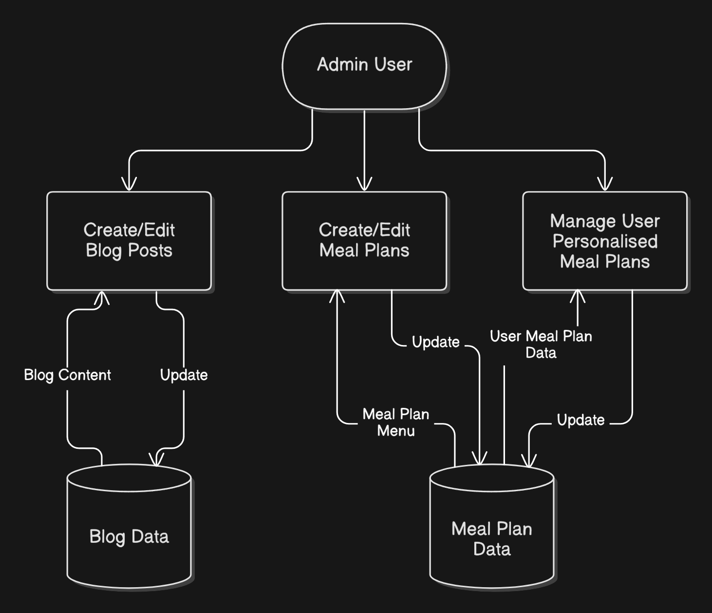
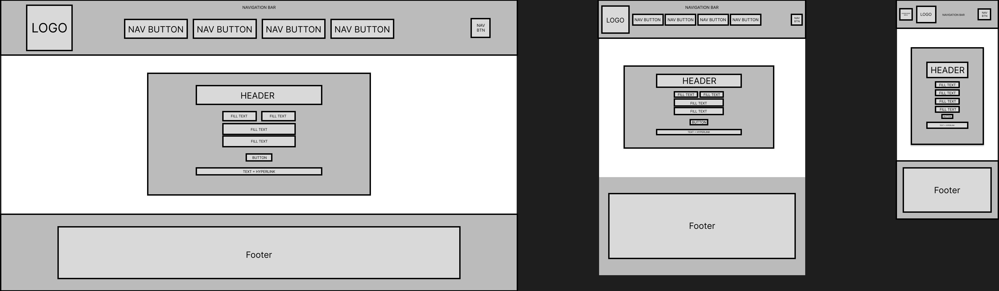

# PlateTonic T3A2-B

### Contributors

Van Nguyen - [GitHub](https://github.com/montsieur)

Veronica Chung - [GitHub](https://github.com/chung-v)

### Deployed Application

- Front End: [https://platetonic.netlify.app](https://platetonic.netlify.app/)

- Back End: [https://platetonic.onrender.com](https://platetonic.onrender.com)

### Repositories

- Front End: [Plate-Tonic/client](https://github.com/Plate-Tonic/client)

- Back End: [Plate-Tonic/server](https://github.com/Plate-Tonic/server)

# Application Setup

## Front End

1. Clone the repository.

```
git@github.com:Plate-Tonic/client.git
cd client
```

2. Create your `.env` file in the root directory.

```
VITE_AUTH_API_URL="your-backend-api-url"
```

3. Install dependencies.

```
npm install
```

4. Run the application.

```
npm run dev
```

## Back End

1. Clone the repository.

```
git@github.com:Plate-Tonic/server.git
cd server
```

2. Create your `.env` file in the root directory.

```
PORT="your-port"
DATABASE_URL="your-database-url"
JWT_SECRET="your-secret-key"
```

3. Start MongoDB.

```
sudo systemctl start mongod
```

4. Install dependencies.

```
npm install
```

5. Seed data into the database.

```
npm run seed
```

6. Run the application.

```
npm run dev
```

# Testing

## Front End - Vitest

### Coverage


### src

<details>
  <summary>Click to expand - Testing performed in src</summary>



</details>

### src/components

<details>
  <summary>Click to expand - Testing performed in src/components</summary>


</details>

### src/contexts

<details>
  <summary>Click to expand - Testing performed in src/contexts</summary>


</details>

### src/pages

<details>
  <summary>Click to expand - Testing performed in src/pages</summary>


</details>

## Back End - Jest/Supertest

### Coverage


### src

<details>
  <summary>Click to expand - Testing performed in src</summary>


</details>

### src/controllers

<details>
  <summary>Click to expand - Testing performed in src/controllers</summary>


</details>

### src/middlewares

<details>
  <summary>Click to expand - Testing performed in src/middlewares</summary>


</details>

### src/models

<details>
  <summary>Click to expand - Testing performed in src/models</summary>


</details>

### src/utils

<details>
  <summary>Click to expand - Testing performed in src/utils</summary>


</details>

# Production Testing

### Homepage 
<details> 
<summary>Click to expand - Homepage renders successfully</summary>


</details>

<details>
<summary>Click to expand - When user refreshes the page, three meals will be randomly generated from the database and rendered</summary>


</details>

### Get Started Page 
When User uses the TDEE Calculator to calculate their macronutrition.

<details> 
<summary>Click to expand - When User Successfully Enters their Details</summary>


</details>

<details> 
<summary>Click to expand - Modal appears when User clicks on 'Calculate TDEE & Macros' on success</summary>


</details>

<details>
<summary>Click to expand - Error; User does not enter their age</summary>


</details>

<details>
<summary>Click to expand - Error; User does not enter their weight</summary>


</details>

<details>
<summary>Click to expand - Error; User does not enter their height</summary>


</details>

### Menu Page
Users are able to view the Menu Page to select, remove and view meals by clicking on the button, name or image. They are also able to dynamically see the changes to their required/intake macros.

<details>
<summary>Click to expand - Shows default state values if User does not use Get Started</summary>

.png)

</details>

<details>
<summary>Click to expand - Shows values after User uses Get Started and/or redirected from page</summary>


</details>

<details>
<summary>Click to expand - User selects one filter</summary>


</details>

<details>
<summary>Click to expand - User selects two filter</summary>


</details>

<details>
<summary>Click to expand - Display's User (non-admin) their requirement and intake (No Meals)</summary>

.png)

</details>

<details>
<summary>Click to expand - Displays User's requirement and Current Intake based on Meal selection</summary>

_selectedmeals.png)

</details>

<details>
<summary>Click to expand - Display's new User calorie requirement after using TDEE calculator again</summary>

_updatedcalories.png)

</details>

<details>
<summary>Click to expand - Add New Meal Button rendered when 'Admin' user logs in (validated)</summary>


</details>

### Meal Detail Page 
<details> 
<summary>Click to expand - Meal Detail Page Renders (For Non-Users and Not Admin Users)</summary>


</details> 

<details>
<summary>Click to expand - Remove Button Renders if User is Admin</summary>

.png)

</details>

<details>
<summary>Click to expand - Modal Appear when Remove Button is clicked to confirm</summary>


</details>

<details>
<summary>Click to expand - Meal has been successfully removed from database</summary>


</details>

### Add New Meal Page
Admin Users have permission to Add New Meal into the database.

<details> 
<summary>Click to expand - Error; No Name input</summary>


</details>

<details>
<summary>Click to expand - Error; No Description input</summary>


</details>

<details>
<summary>Click to expand - Error; No Ingredients input</summary>


</details>

<details>
<summary>Click to expand - Error; No Calorie Value input</summary>


</details>

<details>
<summary>Click to expand - Error; No Protein Value Input</summary>


</details>

<details>
<summary>Click to expand - Error; No Fats Value Input</summary>


</details>

<details>
<summary>Click to expand - Error; No Carbs Value Input</summary>


</details>

<details>
<summary>Click to expand - Error; No Image Selected</summary>



</details>

<details>
<summary>Click to expand - Error; No Filter Selected</summary>


</details>

<details>
<summary>Click to expand - Notification when Meal has been added successfully into database</summary>


</details>

<details>
<summary>Click to expand - Admin is redirected to Menu Page, showing new Meal in the page</summary>


</details>

### About Page
User can view the About Page.

<details> 
<summary>Click to expand - About Page rendered successfully</summary>


</details>

### Blog Page
User can view blog posts & filter blogs to show selected.

<details> 
<summary>Click to expand - Blog page renders successfully (Non-User & User(Not Admin))</summary>


</details>

<details>
<summary>Click to expand - Add New Blog Button renders when Admin User is logged in</summary>


</details>

<details>
<summary>Click to expand - When User selects one filter</summary>


</details>

<details>
<summary>Click to expand - When User selects two filters</summary>


</details>


### Blog Detail Page
Users are able to view blog posts. Shown differently depends on Admin/Non-Admin.

<details> 
<summary>Click to expand - Blog Detail Page renders successfully (Non-Users & Users(Not Admin))</summary>


</details>

<details>
<summary>Click to expand - Remove Button renders when Admin is logged in</summary>


</details>

<details>
<summary>Click to expand - Removal Confirmation modal appears when Admin clicks on Remove Blog</summary>


</details>

<details>
<summary>Click to expand - Remove Blog Success Notification Pop Up when confirmed</summary>


</details>


### Add New Blog Page
Admin Users have permission to Add New Blog.

<details> 
<summary>Click to expand - Error; Title input is missing</summary>


</details>

<details>
<summary>Click to expand - Error; Author input is missing</summary>


</details>

<details>
<summary>Click to expand - Error; Content input is missing</summary>


</details>

<details>
<summary>Click to expand - Error; When duplicate titles has been found, cannot create blog post</summary>


</details>

<details>
<summary>Click to expand - Notification of success when all details correct</summary>


</details>

<details>
<summary>Click to expand - Redirects Admin to Blog Page, showing new blog post</summary>


</details>

### Contact Page
User to input their queries successfully unless:

<details> 
<summary>Click to expand - Error; Invalid/Missing Name</summary>


</details>

<details>
<summary>Click to expand - Error; Invalid '@' Email Input</summary>


</details>

<details>
<summary>Click to expand - Error; Missing Email Input</summary>


</details>

<details>
<summary>Click to expand - Error; No Message Input Found</summary>


</details>

<details>
<summary>Click to expand - Success Notification Appears when User has input all boxes</summary>


</details>

### Login Page
Directs to User Dashboard upon success. Otherwise:

<details> 
<summary>Click to expand - When User Email/Password does not match the database</summary>


</details>

<details>
<summary>Click to expand - Error; Missing Password Input</summary>


</details>

<details>
<summary>Click to expand - Error; Missing Email Input</summary>


</details>


### Forget Password Page
Users can reset their password. Upon success, redirects user back to Login page to try again.

<details> 
<summary>Click to expand - Error; Missing Email Input, on success, move to next page</summary>


</details>

<details>
<summary>Click to expand - Error; Missing Security Answer, on success, move to next page</summary>


</details>

<details>
<summary>Click to expand - Error; Security Answer is incorrect</summary>


</details>

<details>
<summary>Click to expand - Error; Missing New Password Input</summary>


</details>

<details>
<summary>Click to expand - Error; Missing Confirm New Password Input</summary>


</details>

<details>
<summary>Click to expand - Error; Passwords do not match</summary>


</details>

<details>
<summary>Click to expand - Success notification if all details correct & redirects user to Login Page</summary>


</details>

### Sign Up Page
New User's are able to create an account to access their Dashboard to better track their needs. 

<details> 
<summary>Click to expand - Error; Missing Name Input</summary>


</details>

<details>
<summary>Click to expand - Error; Invalid Email Input</summary>


</details>

<details>
<summary>Click to expand - Error; Missing Email Input</summary>


</details>

<details>
<summary>Click to expand - Error; Missing Password Input</summary>


</details>

<details>
<summary>Click to expand - Error; Missing Confirm Password Input</summary>


</details>

<details>
<summary>Click to expand -Error; If Password does not match</summary>


</details>

<details>
<summary>Click to expand - Error; No Security Answer Input</summary>


</details>

<details>
<summary>Click to expand - User did not check to agree to T&C</summary>


</details>

<br>

**Scenario: If user does not use Get Started Calculator before Registration**

<details>
<summary>Click to expand - No Personal Detail Data, shows N/A</summary>


</details>

<details>
<summary>Click to expand - No Calorie Data, shows 0</summary>


</details>

<details>
<summary>Click to expand - No Meals Selected, Calculate your Macros appear if no data for User is stored.</summary>


</details>

<br>

**Scenario: If user uses Get Started before Registration (data stored from calculator)**

<details>
<summary>Click to expand - Shows User using calculator with displayed details</summary>


</details>

<details>
<summary>Click to expand - Personal Details displayed from results after registration </summary>


### Dashboard
After logging in, Users can track their details in their dashboard fetched from the database, selecting different tabs to navigate.

<details> 
<summary>Click to expand - Displays User's Personal Details</summary>


</details>

<details>
<summary>Click to expand - Displays User's current calorie requirement and intake</summary>


</details>

<details>
<summary>Click to expand - Displays User's current meal selection, showing no meals selected currently</summary>


</details>

<details>
<summary>Click to expand - Displays and renders the Change Password Section</summary>


</details>

<details>
<summary>Click to expand - Error; Password must not be the current Password</summary>


</details>

<details>
<summary>Click to expand - Error; Both Password fields must be inputted</summary>


</details>

<details>
<summary>Click to expand - Error; If User's current Password input is incorrect</summary>


</details>

<details>
<summary>Click to expand - Success notification if all details are input correctly</summary>


</details>

<br>
**Scenario: When existing User uses the TDEE calculator to update their details and has chosen meals from the menu page
<details>
<summary>Click to expand - Displays updated Personal Details</summary> clicking on image or name of meal will redirect user to the Meal Details Page shown above


</details>

<details>
<summary>Click to expand - Displays Meals selected by User from the Menu Page</summary>


</details>

<details>
<summary>Click to expand - Displays updated Calorie Tracker details</summary>


</details>

<details>
<summary>Click to expand - Displays updated Calorie Tracker details when User changes/removes their Meal Selection</summary>


</details>


### Terms & Conditions Page
<details> 
<summary>Click to expand - Terms & Conditions Page renders successfully</summary>


</details>

# Wireframes

These are the high fidelity/complete wireframes of the website in Desktop, Tablet & Mobile View. Our styling and design concepts have changed from what we initially planned. We have changed the theme to be minimilistic but still show a clean and professional aesthetic. Although we were not able to implement the pages such as Subscription and Payment, we will implement this in the future to ensure we have a completed API from the initial plan.

### Home Page

<details>
<summary>Click to expand - For Desktop View</summary>


</details>

<details>
<summary>Click to expand - For Tablet View</summary>


</details>

<details>
<summary>Click to expand - For Mobile View</summary>


</details>

### Get Started Page

<details>
<summary>Click to expand - For Desktop View</summary>


</details>

<details>
<summary>Click to expand - For Tablet View</summary>


</details>

<details>
<summary>Click to expand - For Mobile View</summary>


</details>

### Menu Page

<details>
<summary>Click to expand - For Desktop View</summary>


</details>

<details>
<summary>Click to expand - For Tablet View</summary>


</details>

<details>
<summary>Click to expand - For Mobile View</summary>


</details>

### Meal Detail Page

<details>
<summary>Click to expand - For Desktop View</summary>


</details>

<details>
<summary>Click to expand - For Tablet View</summary>


</details>

<details>
<summary>Click to expand - For Mobile View</summary>


</details>

### Add New Meal Page

<details>
<summary>Click to expand - For Desktop View</summary>


</details>

<details>
<summary>Click to expand - For Tablet View</summary>


</details>

<details>
<summary>Click to expand - For Mobile View</summary>


</details>

### About Page

<details>
<summary>Click to expand - For Desktop View</summary>


</details>

<details>
<summary>Click to expand - For Tablet View</summary>


</details>

<details>
<summary>Click to expand - For Mobile View</summary>


</details>

### Blog Page

<details>
<summary>Click to expand - For Desktop View</summary>


</details>

<details>
<summary>Click to expand - For Tablet View</summary>


</details>

<details>
<summary>Click to expand - For Mobile View</summary>


</details>

### Blog Detail Page

<details>
<summary>Click to expand - For Desktop View</summary>


</details>

<details>
<summary>Click to expand - For Tablet View</summary>


</details>

<details>
<summary>Click to expand - For Mobile View</summary>


</details>

### Add New Blog Page

<details>
<summary>Click to expand - For Desktop View</summary>


</details>

<details>
<summary>Click to expand - For Tablet View</summary>


</details>

<details>
<summary>Click to expand - For Mobile View</summary>


</details>

### Contact Us Page

<details>
<summary>Click to expand - For Desktop View</summary>


</details>

<details>
<summary>Click to expand - For Tablet View</summary>


</details>

<details>
<summary>Click to expand - For Mobile View</summary>


</details>

### Terms & Conditions Page

<details>
<summary>Click to expand - For Desktop View</summary>


</details>

<details>
<summary>Click to expand - For Tablet View</summary>


</details>

<details>
<summary>Click to expand - For Mobile View</summary>


</details>

### Login Page

<details>
<summary>Click to expand - For Desktop View</summary>


</details>

<details>
<summary>Click to expand - For Tablet View</summary>


</details>

<details>
<summary>Click to expand - For Mobile View</summary>


</details>

### Forgot Password Page

<details>
<summary>Click to expand - For Desktop View</summary>


</details>

<details>
<summary>Click to expand - For Tablet View</summary>


</details>

<details>
<summary>Click to expand - For Mobile View</summary>


</details>

### Sign Up Page

<details>
<summary>Click to expand - For Desktop View</summary>


</details>

<details>
<summary>Click to expand - For Tablet View</summary>


</details>

<details>
<summary>Click to expand - For Mobile View</summary>


</details>

### Dashboard - Personal Details

<details>
<summary>Click to expand - For Desktop View</summary>


</details>

<details>
<summary>Click to expand - For Tablet View</summary>


</details>

<details>
<summary>Click to expand - For Mobile View</summary>


</details>

### Dashboard - Calorie Tracker

<details>
<summary>Click to expand - For Desktop View</summary>


</details>

<details>
<summary>Click to expand - For Tablet View</summary>


</details>

<details>
<summary>Click to expand - For Mobile View</summary>


</details>

### Dashboard - Current Meals

<details>
<summary>Click to expand - For Desktop View</summary>


</details>

<details>
<summary>Click to expand - For Tablet View</summary>


</details>

<details>
<summary>Click to expand - For Mobile View</summary>


</details>

### Dashboard - Change Password

<details>
<summary>Click to expand - For Desktop View</summary>


</details>

<details>
<summary>Click to expand - For Tablet View</summary>


</details>

<details>
<summary>Click to expand - For Mobile View</summary>


</details>

# Project Management

Trello has been used as the primary project management tool to track progress and ensure deadlines have been met. A structured board has been established with lists representing different project phases:

- **To Do** - Pending tasks.
- **Doing** - Tasks in progress.
- **Review** - Completed tasks awaiting feedback.
- **Done** - Approved and finalised tasks.

## 21 February

Cards have been created, incorporating checklists outlining the necessary files for operating the application.


## 28 February

The primary objective for the week has been to conduct research on implementing Stripe and facilitating image uploads without relying on third-party services.

Adjustments have been made to the "Middlewares" checklist to enhance the efficiency of the image upload process.


### Screenshot of Progress


## 7 March

Each team member has concentrated on either the front end or back end development. Due to time constraints, the subscription feature has been designated as a stretch goal.

#### Front end

- Removed subscription options page and style.
- Removed checkout page and style.
- Removed payment page and style.
- Added forgot password page and style.

#### Back end

- Removed subscription model, controller and route.
- Removed order model, controller and route.
- Separated user registration and login functions to `AuthController` and `AuthRoutes`.
- Added security questions as a `utils` file to improve modularity.

### Screenshot of Progress


## 14 March

The subscription feature could not be implemented. However, all other tasks have been successfully completed, reviewed, and documented in the README file within the repository.

### Screenshot of Progress


# PlateTonic T3A2-A Contents

# R1 Description of your website, including purpose, functionality / features, target audience and tech stack

## Purpose

Plate Tonic is an innovative meal prep service designed to help individuals manage their weight effectively. It offers calorie and macronutrient tracking, ~~personalised~~ meal plans, and educational resources to support weight loss, maintenance, or muscle gain.

## Functionality / Features

### TDEE Calculator

Calculates daily calorie and macronutrient needs based on activity level and fitness goals.

### Calorie and Macronutrient Tracking

Monitors calorie and macronutrient intake to ensure users stay on track with their fitness objectives.

### Personalised Meal Plans

Allows users to input their dietary preferences and goals to receive ~~customised~~ meal plans.

### ~~Subscription Models~~

~~Offers flexible weekly and monthly subscription plans for meal deliveries.~~

### Educational Content

Provides blogs, recipes, and tips to promote healthy eating habits.

## Target Audience

- Individuals aiming to lose weight, maintain their current weight, or gain muscle.
- Health-conscious individuals who prefer the convenience of meal prep.
- Fitness enthusiasts tracking their calorie and macronutrient intake.

## Tech Stack

### Frontend

- HTML
- CSS
- React

### Backend

- Node.js
- Express.js

### Database

- MongoDB

### Authentication

- JWT for user login~~ and subscriptions~~

### Hosting

- Netlify for frontend
- Render for backend

# R2 Dataflow Diagrams

The following dataflow diagrams are structured across multiple levels to progressively illustrate greater detail about a system or process. They highlight how data moves, is processed, and is stored throughout the application.

## Legend


## Level 0 - Context Diagram

<details>
  <summary>Click to expand - Initial Diagram</summary>


</details>

#### Updated Diagram


## Level 1 - Main Processes

### General User Dataflow Diagram

<details>
  <summary>Click to expand - Initial Diagram</summary>


</details>

#### Updated Diagram


### Admin User Dataflow Diagram

<details>
  <summary>Click to expand - Initial Diagram</summary>


</details>

#### Updated Diagram



## Level 2 - Sub-Processes

### User Registration and Login Dataflow Diagram


### ~~Subscription Payment Dataflow Diagram~~

<details>
  <summary>Click to expand - Initial Diagram</summary>


</details>

# R3 Application Architecture Diagram

<details>
  <summary>Click to expand - Initial Diagram</summary>


</details>

#### Updated Diagram


## Frontend

Built with HTML, CSS, and React, the frontend creates the user interface and fetches data from the backend via API requests. It dynamically updates the UI based on user interactions and API responses. The frontend will be deployed via Netlify.

### HTML and CSS

HTML provides the structure of web pages. CSS is used for styling, layout, and responsiveness.

### React

React manages the dynamic components:

- **Registration and login**.
- **User dashboard** - Displays user data, meal plans~~, and subscription details.~~
- **TDEE calculator and calorie/macronutrient tracker** - Tracks calorie and macronutrient intake.
- **Meal plan menu** - Displays available meal plans.
- ~~**Subscription plan menu** - Handles plan selection and management.~~
- **Blog posts** - Displays health and nutrition articles.

## Backend

Built using Node.js and Express.js, the backend handles business logic, data processing, authentication, and API routing. It utilises middleware for logging, error handling, and request validation, while environment variables manage configurations for scalability. The backend will be deployed via Render.

### Node.js and Express.js

Key components include:

- **Authentication service** - Manages user login and registration using JWT authentication.
- **Calorie and macronutrient tracker** - Monitors and stores user calorie and macronutrient intake.
- **Meal plan service** - Fetches and stores personalised meal plans based on user preferences.
- ~~**Subscription service** - Handles user subscriptions and integrates with **Stripe** for payment processing.~~
- **Blog service** - Manages blog content, including creation, updates, and retrieval.

### Mongoose

Mongoose is an Object Data Modeling (ODM) library that structures and interacts with MongoDB. It queries the database to retrieve, update, and store data.

## Database

The database communicates with the backend by sending and receiving structured documents.

### MongoDB

The application uses MongoDB to store:

- **User data** - Account details, macro tracking, dietary preferences, and payment records.
- **Meal plan data** - Tailored meal plans based on user preferences and goals.
- ~~**Subscription data** - User subscription details, including plan type and payment status.~~
- **Blog data** - Health and nutrition articles.

## ~~Third Party APIs~~

### ~~Stripe~~

~~Stripe is integrated as the payment gateway to handle subscriptions and payments securely.~~

~~The process involves:~~

1. ~~**Frontend** - Provides a payment form where users enter card details. **Stripe.js** securely tokenises the card information and sends it to Stripe’s servers.~~
2. ~~**Backend** - Communicates with Stripe’s API using a **secret key** to create a payment intent and process transactions.~~
3. ~~**Webhooks** - Stripe webhooks are used to handle payment events (e.g. successful payments, subscription cancellations) and update the database accordingly.~~
4. ~~**Database** - Payment status and subscription details are stored in MongoDB.~~

# R4 User Stories

## Persona 1 - Personal Trainer


### User Stories

"As a personal trainer, I want a meal prep service that helps me optimise my macronutrient intake, so I can improve my muscle gain and endurance."

"As someone with a busy training schedule, I want healthy meals that are quick and easy to prepare, so I can stay on top of my nutrition and fuel my workouts without sacrificing performance."

## Persona 2 - Software Engineer


### User Stories

"As a professional who works long hours, I want a meal prep service that offers healthy, ~~ready-to-eat~~ meals, so I can maintain a balanced diet despite my demanding schedule."

"As someone with limited nutrition knowledge, I want access to meal plans that are designed for weight management, so I can make better food choices without extensive research."

## Persona 3 - Stay At Home Mother


### User Stories

"As a health-conscious mother, I want a meal plan that supports my personal health goals, so I can maintain a balanced diet and feel energised throughout my day."

"As a mother of two, I want a meal plan that accommodates my children's dietary preferences, so I can ensure they enjoy their meals while still meeting their nutritional needs."

# R5 Wireframes for multiple standard screen sizes, created using industry standard software

For each page, we have planned and designed low to medium level fidelity using Figma. This is to show and demonstrate and draft each page's layout to understand the project's flow, structure and the usage and implementation of each component on each page. Furthermore, this will be set as the base standard to create a high fidelity wireframe in the future and improve on the user interface to ensure user experience is met to it's full potential.

Each wireframe template uses the following dimensions of approximately as base and ensures responsive design:

- **Desktop**: 1920 x 1080
- **Tablet**: 728 x 1024
- **Mobile**: 375 x 812

Each page will consist of at least:

- **Navigation Bar**: To navigate to different pages of the website such as user login page, menu, about, contact, etc.
  - In mobile view, the navigation buttons will be condensed into a hamburger style drop down menu.
- **Footer**: Will consist of different hyperlinks to different pages as above.
  - In mobile view, this will be condensed into a drop down menu.

## 1. Homepage

The home page will consist of the main information of marketing Plate Tonic as a meal prep service.

The key features will include:

- **Banners**: As images to showcase and market the brand such as brand information and testimonials.
- **Buttons**: To redirect a user to relevant page.
  - For example, clicking on "Get Started" will direct a user to the TDEE page to calculate their recommended calorie intake and macro.

### Wireframe

<details>
  <summary>Click to expand - Home Page</summary>


</details>

### Detailed Wireframe

<details>
  <summary>Click to expand - Home Page</summary>

/home_page.jpg>)

</details>

## 2. About Page

The purpose of the about page is to provide information about the company such as the business goal and objectives for the user to get to know more about the company.

The key features will include:

- **Images & Text**: This will consist of main marketing image and information text about Plate Tonic.

### Wireframe

<details>
  <summary>Click to expand - About Page</summary>


</details>

### Detailed Wireframe

<details>
  <summary>Click to expand - About Page</summary>

/about_page.jpg>)

</details>

## 3. Login Page

The login page will allow a user to use their registered information to then access the user dashboard.

The key features will include:

- **Fill Text**: This is where the user will input their email address and password.
- **Login button**: This button is to redirect the user to the user dashboard if successful.
- **Hyperlinks**: If a user has forgotten their password or has not registered an account yet, there will be a hyperlink option for the user to do what they require.

### Wireframe

<details>
  <summary>Click to expand - Login Page</summary>


</details>

### Detailed Wireframe

<details>
  <summary>Click to expand - Login Page</summary>

/login_page.jpg>)

</details>

## 4. Registraton Page

The registration page is accessed from the login page once the user has clicked on the hyperlink option. Here they are able to enter their details to register an account.

The key features will include:

- **Fill Text**: Allows the user to enter their name, email address and password.
- **Submit button**: Will allow user to submit their details to create an account if email address is not in use.
- **Hyperlink**: If a user has an account already or notices that the email address has been used already, they can redirect themselves to the login page to attempt to log in or direct themselves to the forgot password page.

### Wireframe

<details>
  <summary>Click to expand - Register Page</summary>



</details>

### Detailed Wireframe

<details>
  <summary>Click to expand - Register Page</summary>

/register_page.jpg>)

</details>

## 5. User Dashboard Page

The purpose of the user dashboard is to allow the user to navigate through their account and access certain features that are available to them such as ~~managing subscriptions,~~ viewing their current meal plan, tracking their calories and macros or to update/view their personal details.

The key features will include:

- **Buttons**: This will allow the user to navigate between the following options such as clicking on Current Meals to view it in the content next to it (on the right).
- **Information Box**: A windowed area next to the button navigations will show the user relevant information to what they have clicked on
  - For example, clicking on Current Meals after viewing their personal details will change the window to show the user their current meal plan.

### Wireframe

<details>
  <summary>Click to expand - User Dashboard Page</summary>


</details>

### Detailed Wireframe

<details>
  <summary>Click to expand - User Dashboard Page</summary>

/user_dashboard_page.jpg>)

</details>

## 6. TDEE Page

The TDEE Page (Total Daily Energy Expenditure) is a page that allows the user to enter their details to calculate the recommended calorie and macro intake for their meal plans.

The key features will include:

- **Buttons**: The user will be able to click the relevant button to enter their details. Once they enter all details, they can click on the submit button to be redirected to the next page (menu page) to show their recommended calorie and macro intake and the recommended meals.
  - The information to click and enter will consist of their gender, age, current and target weight and their current activity for exercise.

### Wireframe

<details>
  <summary>Click to expand - TDEE Page</summary>


</details>

### Detailed Wireframe

<details>
  <summary>Click to expand - TDEE Page</summary>

/TDEE_page.jpg>)

### Wireframe

</details>

## ~~7. Subscription Page~~

~~The subscription page allows user's to opted in to Plate Tonic's services so they are able gain access to specific features such as choosing/ordering their meals for their meal plan.~~

~~The key features will include:~~

- ~~**Buttons**: This allows users to choose from the following options that suits their needs.~~
  - ~~For example, user can choose between a weekly or monthly subscription. By choosing a monthly subscription, it can be slightly cheaper allowing the user to save on expense.~~
- ~~**Fill Text**: An area for the user to enter their details such as postal address.~~
- ~~**Drop down Menu**: This area will allow the user to choose from the following payment methods to purchase the subscription.~~
- ~~**Information box**: This will show the user the summary of their chosen options and pricing before hitting the submit button below.~~

### ~~Wireframe~~

<details>
  <summary>Click to expand - Subscription Page</summary>


</details>

### ~~Detailed Wireframe~~

<details>
  <summary>Click to expand - Subscription Page</summary>

/subscription_page.jpg>)

</details>

## 8. Menu Page

The menu page is for the user to see what meals are available to choose from ~~before they subscribe to the services or to choose their meals if they are already using the service~~.

The key features will include:

- **Filter Menu**: User will be able to filter accordingly to filter options to their needs.
- **Calorie/Macro information**: Once a user has entered their information on the TDEE calculator, this information will show and calculate accordingly to what is recommended as reference and total of calories/macros from the meals chosen. If the user has not entered these details, there will be a hyperlink to redirect the user to calculate if they wish to do so.
- **Image Button**: A list of meals a user can view. Once they click on one of the options, it will show the user in a small window more information about that specific meal.

### Wireframe

<details>
  <summary>Click to expand - Menu Page</summary>


</details>

### Detailed Wireframe

<details>
  <summary>Click to expand - Menu Page</summary>

/menu_page.jpg>)

</details>

## ~~9. Payment Page~~

~~The payment page is the final page after submitting the details from the Subscription Page. Here the user is able to enter their payment details and finalize their purchases~~

~~The key feature will include:~~

- ~~**Fill Text**: This area is for the user to enter their billing details and payment method details.~~
- ~~**Button**: For user to submit and finalize their purchase.~~

### ~~Wireframe~~

<details>
  <summary>Click to expand - Payment Page</summary>


</details>

### ~~Detailed Wireframe~~

<details>
  <summary>Click to expand - Payment Page</summary>

/payment_page.jpg>)

</details>

## 10. Blog Page

The blog page will contain different articles that a user can view and access that shows different information. For example, an article on 'How to stay fit' is a blog post a user can view to get more information about this topic.

The key feature will include:

- **Filter Menu**: User is able to filter by the topic of what they wish to see.
- **Image Link**: User is able to access the blog post by clicking on the image and this will redirect them to the blog itself.

### Wireframe

<details>
  <summary>Click to expand - Blog Page</summary>


</details>

### Detailed Wireframe

<details>
  <summary>Click to expand - Blog Page</summary>

/blog_page.jpg>)

</details>

## 11. Contact Page

The contact page's purpose is to allow user to send any enquiries they have whether it is about the brand, services, etc.

The key feature will include:

- **Fill Text**: An area where the user is able to enter the details of their query.
- **Button**: After entering the details, user can click the send/submit button to send off their query.
- **Information Box**: An area providing further information for the user.
  - For example: "If you have any queries about any of our services or require assistance, feel free to submit it through our contact page. We are always happy to help you and will get back to you as soon as possible".
  - It will also contain a direct email if they wish to do so rather submitting it through the contact page.

### Wireframe

<details>
  <summary>Click to expand - Contact Page</summary>


</details>

### Detailed Wireframe

<details>
  <summary>Click to expand - Contact Page</summary>

/contact_page.jpg>)

</details>

# R6 Screenshots of your Trello board throughout the duration of the project

Our team used Trello to implement Agile methodology and streamline task management. Trello’s visual interface made it easy to track progress at a glance.

To organise our workflow, we structured our Trello board into four lists representing task progress:

- **To Do** - Pending tasks.
- **Doing** - Tasks in progress.
- **Review** - Completed tasks awaiting feedback.
- **Done** - Approved and finalised tasks.

We followed an iterative approach, moving tasks through these stages. Once a task reached the Review column, team members provided feedback to ensure it met project standards. After approval, the task was documented in the README file on our repository and moved to Done.

In addition to Trello, our team held weekly check-ins to review progress and discuss pain points. We also used Discord for ongoing collaboration, allowing us to discuss the project in real time. This approach helped maintain alignment and adaptability throughout the development process.

## 28 January

Cards have been created with detailed checklists for clarity. The team has established a structured check-in schedule, meeting every Thursday to review progress. A final check-in has been scheduled on the day of the deadline to ensure all tasks are completed and project objectives are met.


## 31 January

Weekly check-ins have been shifted to Fridays to better align with our personal schedules. The "Website Description" has been completed, and team members have begun working on "User Stories" and "Wireframes".

Adjustments have been made to the "Wireframes" checklist to streamline certain pages for simplicity.


### Screenshot of Progress


## 7 February

"User Stories" and "Wireframes" have been submitted for review. Work has begun on drafting the various diagram levels within the "Data Flow Diagram."

### Screenshot of Progress


## 14 February

The team has begun adding components to the README file in the repository. The "Data Flow Diagram" has been completed, while the "Wireframes" have been re-evaluated for further refinement, requiring additional adjustments to the home page and user dashboard.

Adjustments have been made to the "Application Architecture Diagram" checklist for a more detailed breakdown of the required tasks.


### Screenshot of Progress


## 16 February

All tasks have been completed, reviewed, and documented in the README file within the repository.


